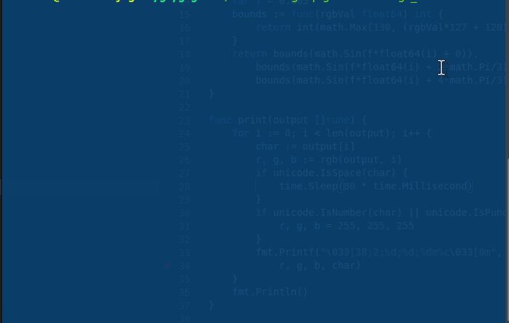

# GoGoCat
[](https://snapcraft.io/gogocat)

[](https://snapcraft.io/gogocat)

```$sudo snap install gogocat```

Then

```$curl https://raw.githubusercontent.com/rogue-elephant/gogocat/master/readme.md | gogocat```


pipe CLI utility for prettifying output.
Based on the excellent tutorial here https://flaviocopes.com/go-tutorial-lolcat/

## Use
```cat main.go | docker run -i rogueelephant/gogocat```


## Example
_(Assuming you have cloned the directory and are in the top folder context)_
```$cat main.go | go run main.go```

```$cat main.go | docker run -i gogocat```

